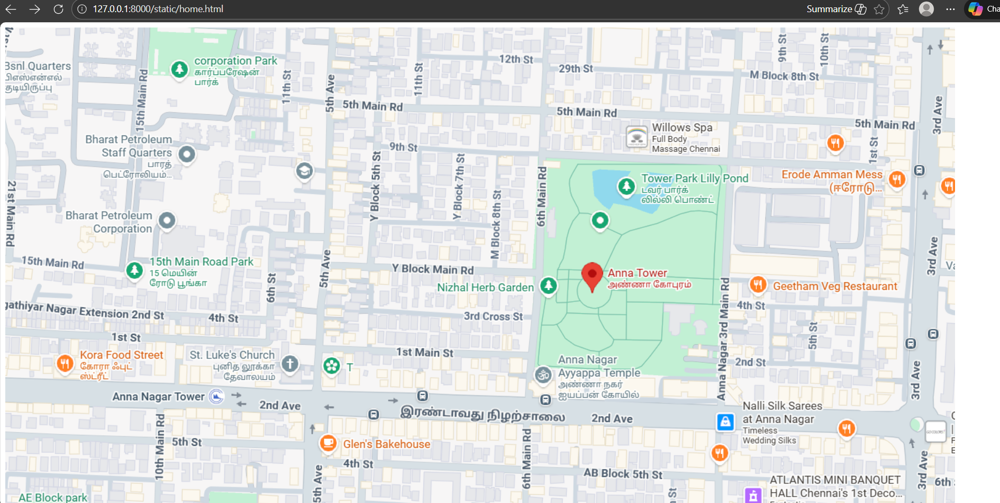
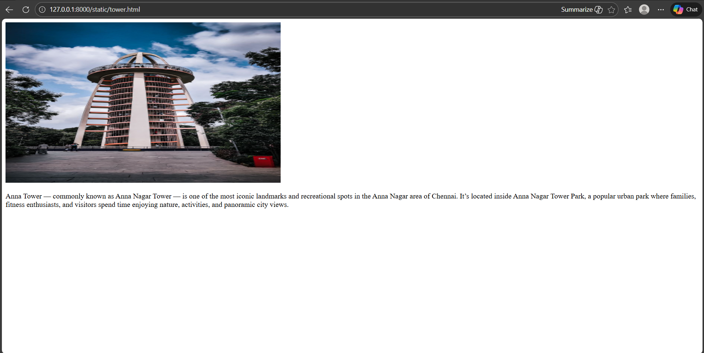

# Ex04 Places Around Me
## Date: 12.12.2025

## AIM
To develop a website to display details about the places around my house.

## DESIGN STEPS

### STEP 1
Create a Django admin interface.

### STEP 2
Download your city map from Google.

### STEP 3
Using ```<map>``` tag name the map.

### STEP 4
Create clickable regions in the image using ```<area>``` tag.

### STEP 5
Write HTML programs for all the regions identified.

### STEP 6
Execute the programs and publish them.

## CODE
```
<!DOCTYPE html>
<html lang="en">
<head>
    <meta charset="UTF-8">
    <meta name="viewport" content="width=device-width, initial-scale=1.0">
    <title>homepage</title>
</head>
<body>
    <!-- Image Map Generated by http://www.image-map.net/ -->


<map name="image-map">
    <area target="" alt="anna tower" title="anna tower" href="tower.html" coords="1070,437,825,311" shape="rect">
    <area target="" alt="kora food street" title="kora food street" href="kora.html" coords="156,516,93" shape="circle">
    <area target="" alt="St.Luke's church" title="St.Luke's church" href="church.html" coords="401,559,299,530,261,484,312,463,369,462,435,462,454,502,450,535" shape="poly">
</map>
</body>
</html>

<!DOCTYPE html>
<html lang="en">
<head>
    <meta charset="UTF-8">
    <meta name="viewport" content="width=device-width, initial-scale=1.0">
    <title>St.Luke's church</title>
</head>
<body>
    
    <p>St. Luke's Church (Anna Nagar) is a prominent Roman Catholic church located at Z-291, 5th Avenue, Z Block, Anna Nagar West, Chennai, Tamil Nadu. It is well-known both as a place of worship and as a community centre serving thousands of Catholics in the area.</p>
</body>
</html>

<!DOCTYPE html>
<html lang="en">
<head>
    <meta charset="UTF-8">
    <meta name="viewport" content="width=device-width, initial-scale=1.0">
    <title>kora food street</title>
</head>
<body>
    
    <p>Kora Food Street is a modern and vibrant food destination located on 2nd Avenue in Anna Nagar, Chennai. It’s designed as a unique food street market that brings together a wide variety of culinary options under one roof, making it a popular hangout spot for food lovers, friends, and families.</p>
</body>
</html>

<!DOCTYPE html>
<html lang="en">
<head>
    <meta charset="UTF-8">
    <meta name="viewport" content="width=device-width, initial-scale=1.0">
    <title>anna tower</title>
</head>
<body>
    
    <p>Anna Tower — commonly known as Anna Nagar Tower — is one of the most iconic landmarks and recreational spots in the Anna Nagar area of Chennai. It’s located inside Anna Nagar Tower Park, a popular urban park where families, fitness enthusiasts, and visitors spend time enjoying nature, activities, and panoramic city views.</p>
</body>
</html>
```

## OUTPUT






## RESULT
The program for implementing image maps using HTML is executed successfully.
